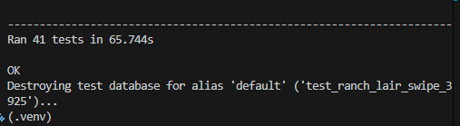
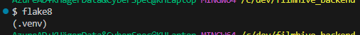
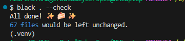

# FilmHive API Testing Documentation

This document outlines the testing approach and results for the FilmHive API backend.

---

## Testing Overview

The FilmHive API uses Django's built-in test framework with `APITestCase` from Django REST Framework for automated endpoint testing of the core features.

**Testing Strategy:**
- Automated unit and integration tests for all major features
- Authentication and permission checks
- Database constraint validation (uniqueness, foreign keys)
- API response structure validation
- User isolation and ownership verification

---

## Running Tests

### Run All Tests

```bash
python manage.py test
```

### Run Tests for Specific App

```bash
python manage.py test films
python manage.py test reviews
python manage.py test favourites
python manage.py test watchlist
python manage.py test profiles
```

### Run with Verbose Output

```bash
python manage.py test --verbosity=2
```

---

## Test Coverage by App

### Films App (`films/tests.py`)

**FilmAPITests:**
- ✅ List films returns 200 and includes created film
- ✅ Retrieve single film by ID
- ✅ Film detail includes annotated fields (`average_rating`, `review_count`, `is_favourited`, `in_watchlist`)

**CompromiseAPITests (Blend Mode):**
- ✅ Requires authentication (401 for unauthenticated users)
- ✅ Validates required parameters (`film_a_id`, `film_b_id`)
- ✅ Prevents same film for both inputs
- ✅ Validates `alpha` parameter (0.0 - 1.0 range)
- ✅ Validates `limit` parameter (max 50)
- ✅ Returns 404 for non-existent films
- ✅ Returns correct response structure (meta, results, film cards, match breakdown, reasons)
- ✅ Results ranked by score (descending)
- ✅ Respects limit parameter
- ✅ Default values: `alpha=0.5`, `limit=20`
- ✅ Returns empty results when no candidates exist
- ✅ Includes explanatory reasons for recommendations
- ✅ Alpha weighting affects ranking

**Total: 18 tests**

---

### Reviews App (`reviews/tests.py`)

**ReviewAPITests:**
- ✅ Anonymous users cannot create reviews (403 Forbidden)
- ✅ Authenticated users can create reviews (201 Created)
- ✅ Review correctly links to user and film
- ✅ User cannot review same film twice (400 Bad Request - database constraint enforced)

**Total: 4 tests**

---

### Favourites App (`favourites/tests.py`)

**FavouriteAPITests:**
- ✅ Anonymous users cannot add favourites (403 Forbidden)
- ✅ Authenticated users can add favourites (201 Created)
- ✅ Favourite correctly links to user and film
- ✅ User cannot add same film twice (400 Bad Request - database constraint enforced)
- ✅ List endpoint returns only the authenticated user's favourites (user isolation verified)

**Total: 5 tests**

---

### Watchlist App (`watchlist/tests.py`)

**WatchlistAPITests:**
- ✅ Anonymous users cannot add watchlist items (403 Forbidden)
- ✅ Authenticated users can add watchlist items (201 Created)
- ✅ Watchlist item uses default name "Watchlist" when none provided
- ✅ Watchlist item correctly links to user and film
- ✅ User cannot add same film twice to same list (400 Bad Request - database constraint enforced)
- ✅ List endpoint returns only the authenticated user's watchlist items (user isolation verified)

**Total: 6 tests**

---

### Profiles App (`profiles/tests.py`)

**UserProfileSignalTests:**
- ✅ Profile automatically created when user is registered (Django signals working)
- ✅ New profile has default empty `preferred_genres` list

**MyProfileViewTests:**
- ✅ Retrieve profile requires authentication (401 for unauthenticated)
- ✅ Authenticated user can retrieve their own profile
- ✅ Profile includes all expected fields (`id`, `preferred_genres`, `created_at`, `updated_at`)
- ✅ Update profile requires authentication (401 for unauthenticated)
- ✅ User can update preferred genres (PATCH)
- ✅ User can update preferred genres (PUT)
- ✅ Changes persist to database

**Total: 8 tests**

---

## Test Summary

| App | Test Count | Status |
|-----|-----------|--------|
| Films | 18 | ✅ All Passing |
| Reviews | 4 | ✅ All Passing |
| Favourites | 5 | ✅ All Passing |
| Watchlist | 6 | ✅ All Passing |
| Profiles | 8 | ✅ All Passing |
| **Total** | **41** | **✅** |



- Tests run using Django test database
- Each test case uses isolated setup

---

## Code Quality & Validation

### Python Linting




The codebase follows PEP 8 standards and is validated using:

**flake8:**
```bash
flake8 .
```

**black (code formatter):**
```bash
black --check .
```

### Code Quality Checks

- ✅ All Python files pass syntax validation
- ✅ No unused imports
- ✅ Proper indentation (4 spaces)
- ✅ Line length compliance (except where necessary for readability)
- ✅ Consistent naming conventions

---

## Manual Testing

The following scenarios have been manually tested via the deployed API and frontend:

### Authentication Flow
- ✅ User registration via `/api/auth/registration/`
- ✅ User login via `/api/auth/login/`
- ✅ Token-based authentication on protected endpoints
- ✅ User logout via `/api/auth/logout/`

### Films Discovery
- ✅ Browse films (unauthenticated access)
- ✅ Search films by title
- ✅ Filter films by genre, year, runtime
- ✅ Order films by popularity, year, critic score
- ✅ View film detail page

### User Interactions
- ✅ Create review (auth required)
- ✅ Edit own review (owner only)
- ✅ Delete own review (owner only)
- ✅ Like/unlike reviews
- ✅ Add/remove favourites
- ✅ Add/remove watchlist items
- ✅ Create multiple named watchlists

### Permissions & Security
- ✅ Users cannot edit/delete other users' reviews
- ✅ Users cannot see other users' favourites/watchlists
- ✅ Database constraints prevent duplicate interactions
- ✅ CORS restricted to frontend domain(s)

### Blend Mode (Compromise Algorithm)
- ✅ Select two films and receive personalized recommendations
- ✅ Adjust alpha weighting (preference balance)
- ✅ View match breakdown and reasons
- ✅ Results ranked by relevance score

---

## Known Test Gaps & Future Improvements

While the current test suite provides solid coverage of core functionality, the following areas could be expanded:

- **Review Likes**: Add automated tests for like/unlike functionality and duplicate prevention
- **Review Reports**: Add tests for reporting inappropriate reviews
- **Edge Cases**: Additional tests for malformed requests, invalid UUIDs, etc.
- **Performance**: Load testing for high-traffic scenarios

---

## Conclusion

The FilmHive API has a robust automated test suite with **41 passing tests** covering authentication, permissions, database constraints, and core CRUD functionality. All tests validate that:

- Unauthenticated users have read-only access where appropriate
- Authenticated users can create and manage their own content
- Users cannot access or modify other users' private data
- Database constraints prevent duplicate interactions
- API responses have correct structure and status codes

The test suite provides confidence that the API meets all PP5 requirements for secure, permission-based access control and data integrity.
